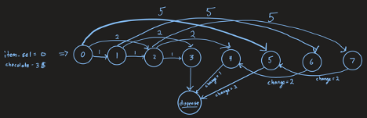
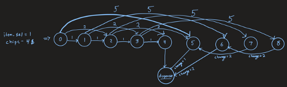
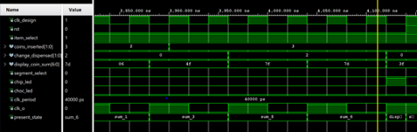

## Vending Machine

A finite-state machine (FSM) designed in VHDL and implemented on the Zybo Z7 board.

The FSM is a vending machine which can dispense chocolate (3$) or chips (4$). 
The states are determined by the selected item, and the coins inserted. 
A 7-segment display attached to the Zybo maintains the current sum of coins inserted. 

In these diagrams the items are selected at the beginning and each state is updated for the amount of money inserted each time. Once enough money has been inserted, change is dispensed followed by the product.

Possible flow paths for buying chocolate:

Possible flow paths for buying chocolate:

# Simulation

Multiple scenarios were tested and simulated, but since only one can be shown in the simulation window at a time I chose one that tested a good portion of the possible state paths.
In this testbench scenario, chips are selected (4$), then coins are inserted in the order 1,2,5 to give a sum 8. Then 2$ is dispensed, and state is set to sum 6, where 2$ again is dispensed and then finally the chips are dispensed. The other scenarios used to test correct functionality are included in the testbench code. 
